# Modelo-de-Administracion-de-Datos

## INDICE

1. Proyecto
2. Objetivo
3. Capturas de Pantalla
4. Tecnologias 
5. Idioma

### Proyecto

Aplicación de escritorio para realizar consultas de la Biblia, el cual fue desarrollado en base a un Modelo Entidad Relacion.

### Objetivo

Desarrollo de una base de datos funcional en base a un mapeo de datos para el diseño de un MER y un MR.

Desarrollo de una aplicación de escritorio siguiendo la metodología de programación orientada a objetos, estableciendo clases para la conexión a una base de datos y métodos que utilicen llamadas a procedimientos almacenados en la base de datos para gestionar toda la información del proyecto. 

### Capturas de Pantalla

Pantallas de mi aplicacion 

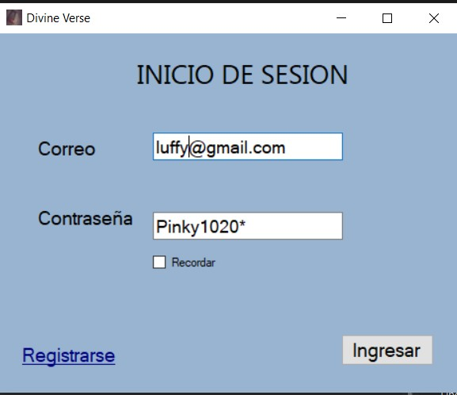

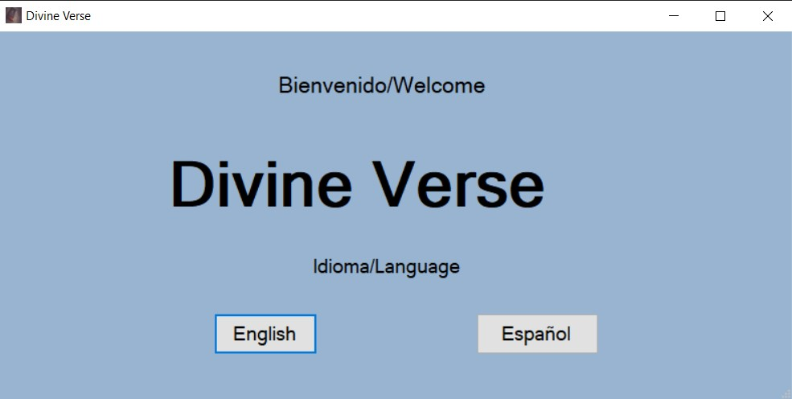
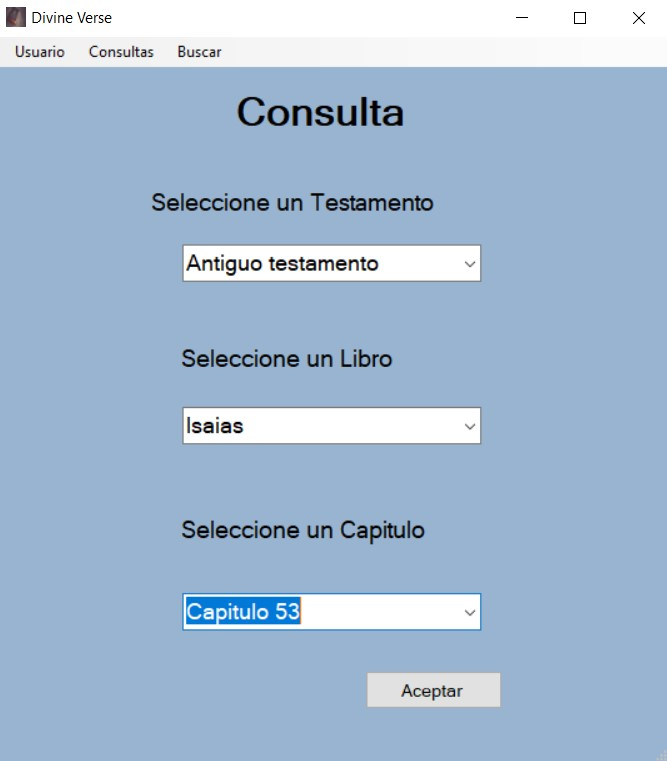
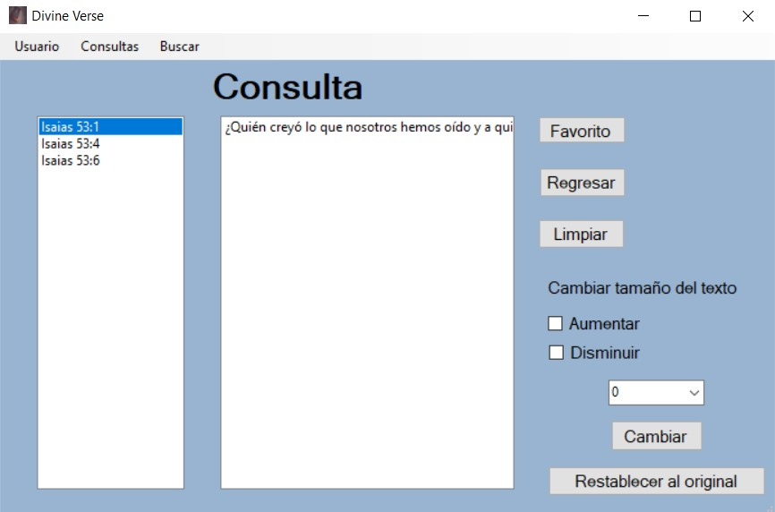
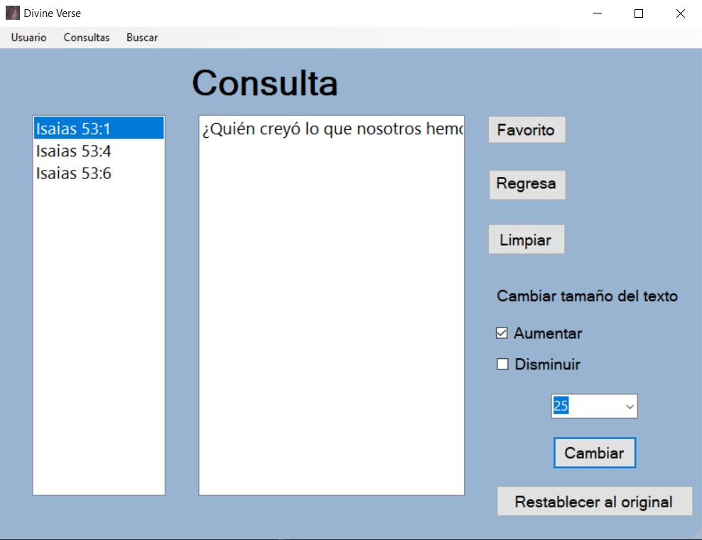
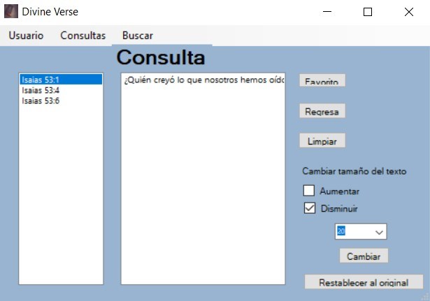
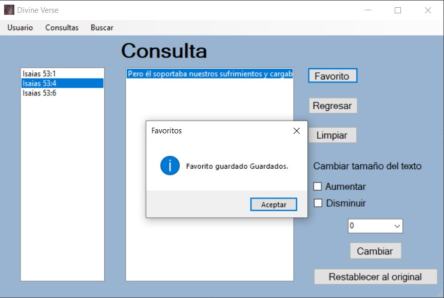
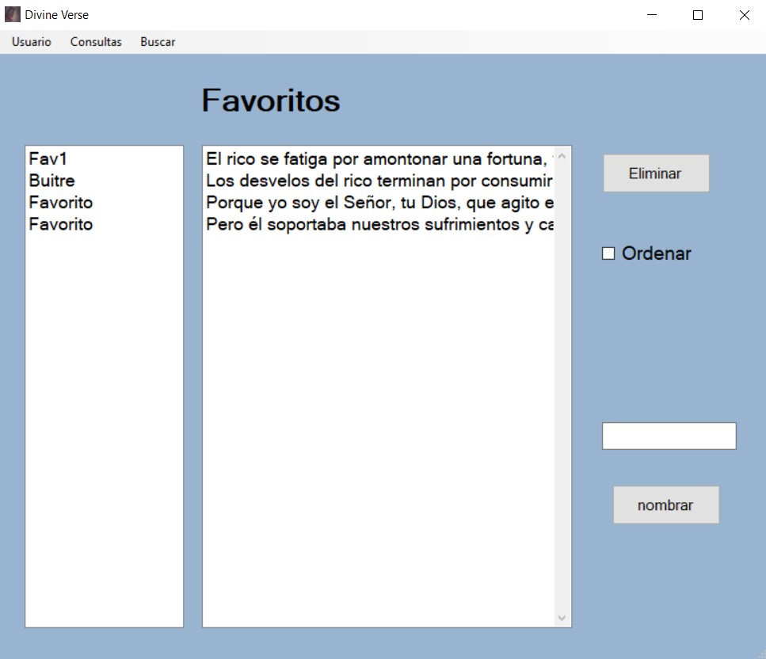

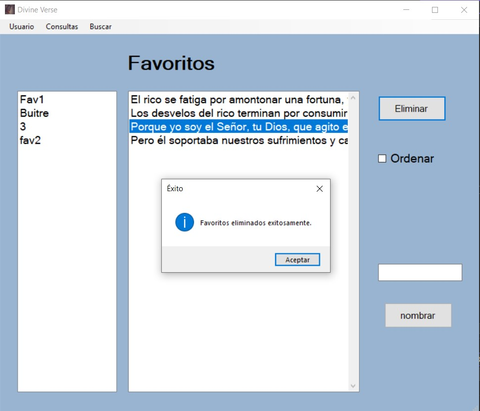
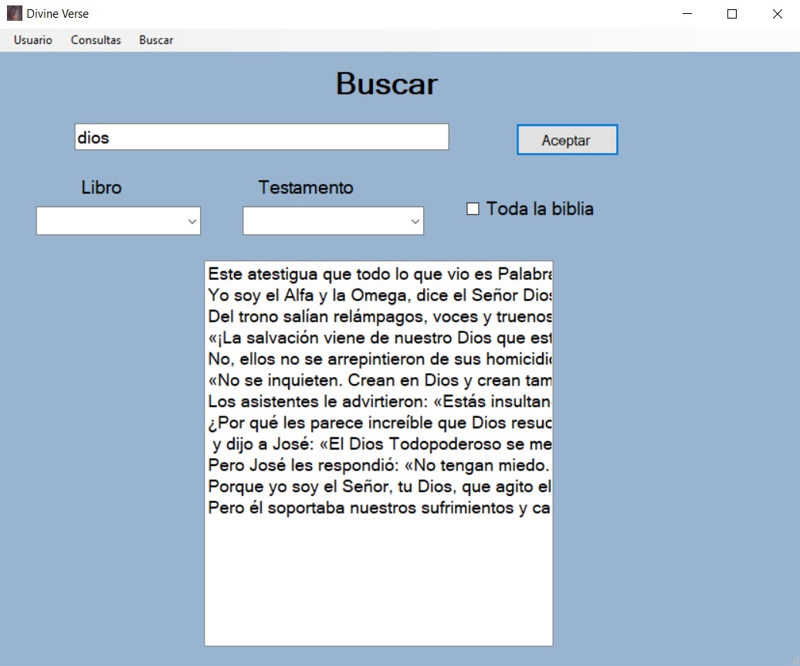
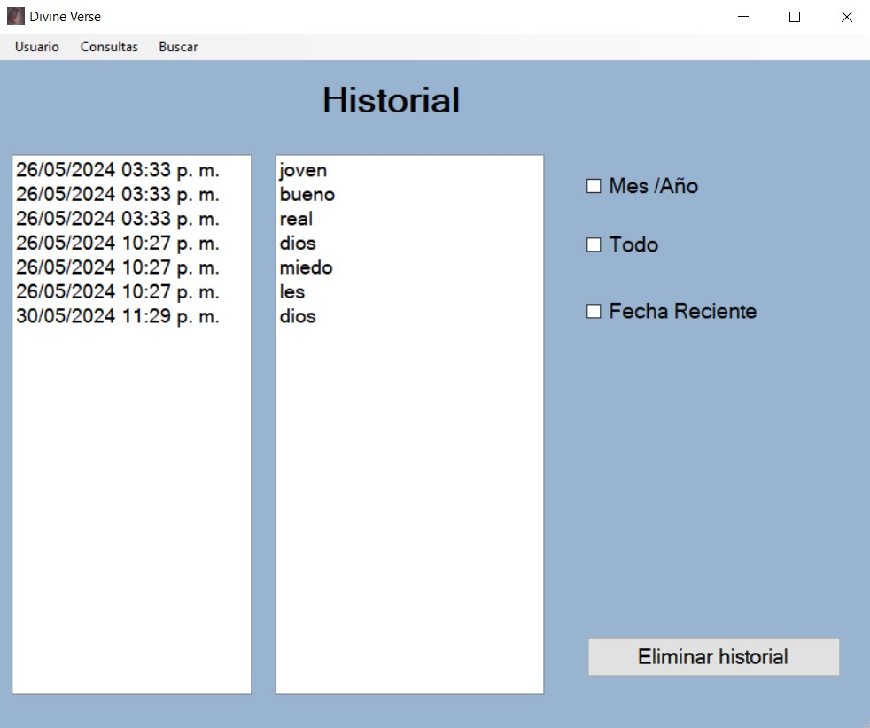
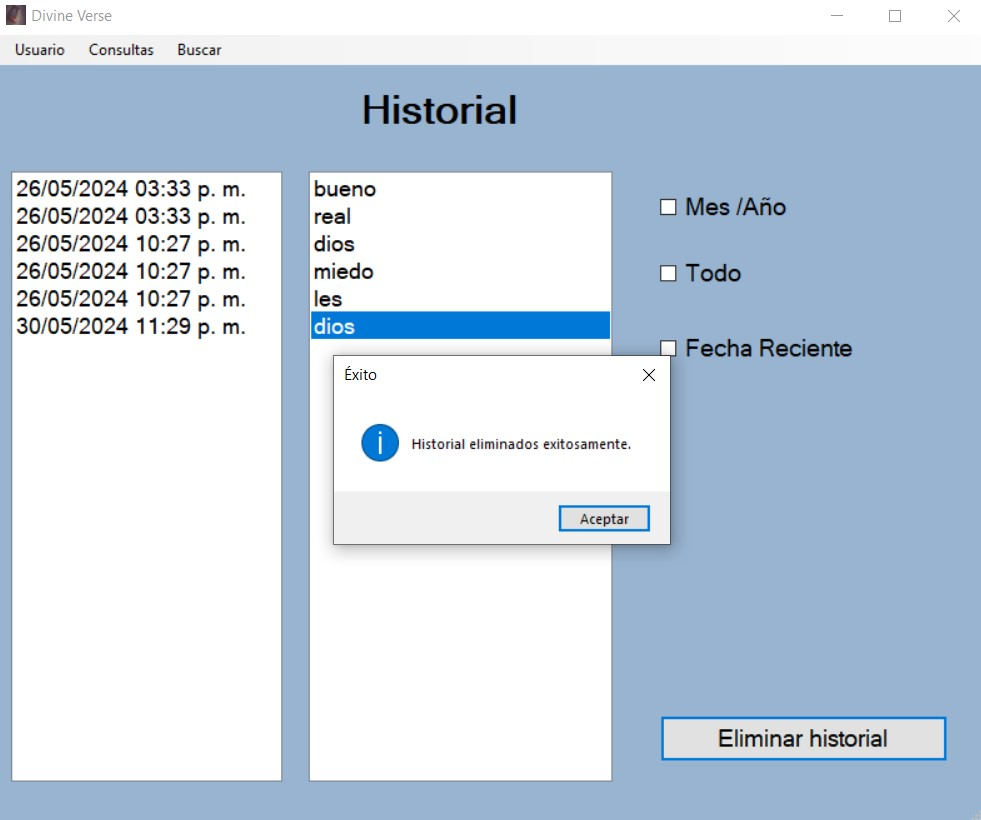
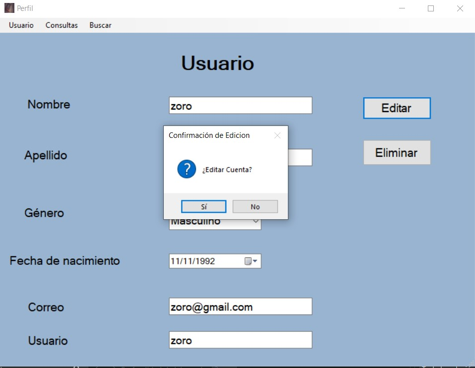
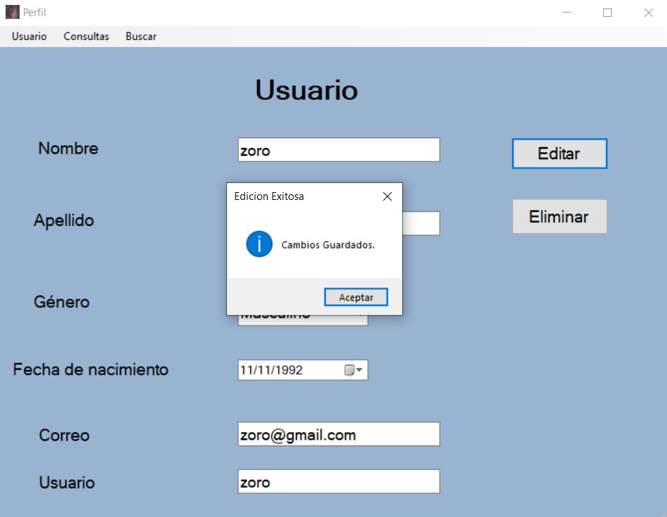
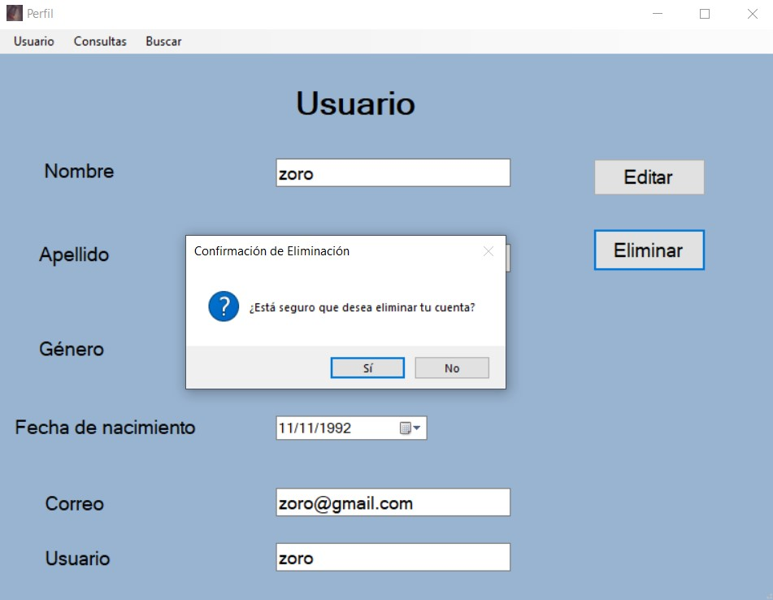
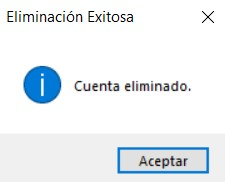

### Tecnologias
Este proyecto fue realizado con:
* C#
* SQL

### Idioma
Español.

